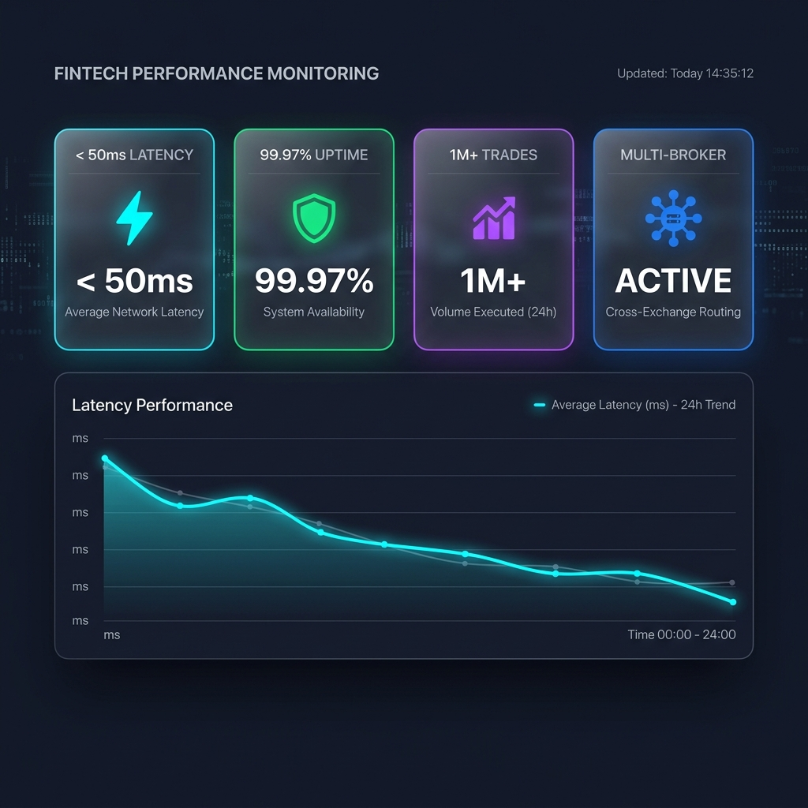
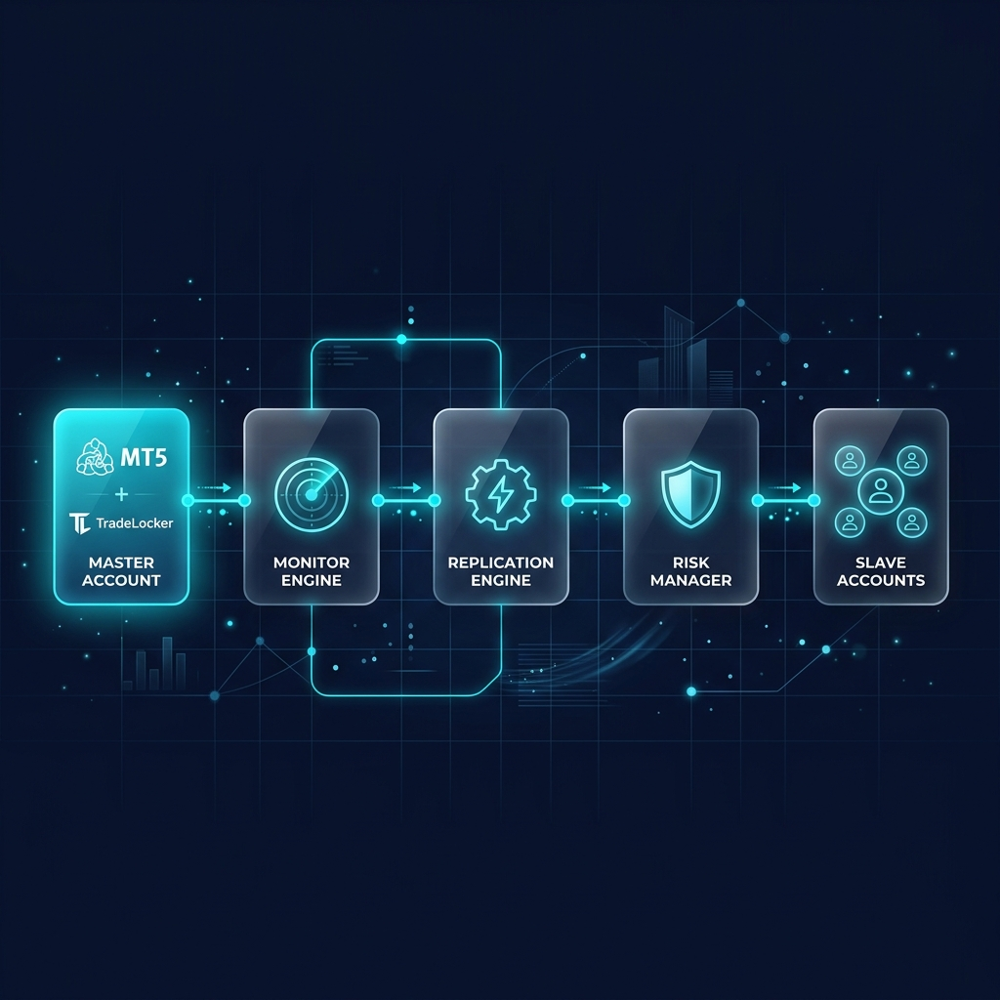
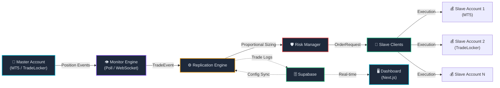

<p align="center">
  
</p>

<h1 align="center">
  <br>
  ⚡ X A P Y
  <br>
  <sup><sub>Institutional-Grade Trade Replication Engine</sub></sup>
</h1>

<p align="center">
  <strong>Replicate trades across brokers at machine speed. Built for precision. Engineered for scale.</strong>
</p>

<p align="center">
  <a href="#-quickstart"></a>
  <a href="#-architecture"></a>
  <a href="#-performance"></a>
  <a href="#-dashboard"></a>
</p>

<p align="center">
  
  
  
  
  
  
</p>

---

<br>

## 🎯 What is Xapy?

**Xapy** is a **high-frequency trade replication engine** that mirrors trades from a master account to unlimited slave accounts across multiple brokers — in real-time, with sub-50ms execution latency.

Built on an **async-first Python core** with a **Next.js 16 command center**, Xapy delivers institutional-grade copy trading with:

| Capability | Description |
|:---:|:---|
| 🔄 **Multi-Broker Replication** | Simultaneously replicate to MetaTrader 5 and TradeLocker accounts |
| ⚡ **Sub-50ms Latency** | Asynchronous event-driven architecture with concurrent execution |
| 🛡️ **Risk Management** | Real-time slippage validation, volume capping, and proportional lot sizing |
| 📊 **Live Dashboard** | Next.js command center with real-time charts, drawdown gauges, and P&L tracking |
| 🔴 **Kill Switch** | Emergency engine halt with instant position close capability |
| 🗄️ **Supabase Backend** | Real-time config sync, trade logging, and persistent state management |

<br>

---

<br>

## 📊 Performance

<p align="center">
  
</p>

### ⚡ Speed & Latency Benchmarks

```
┌─────────────────────────────────────────────────────────────────────┐
│                    EXECUTION PIPELINE LATENCY                       │
├─────────────────────┬────────────┬──────────┬──────────────────────┤
│ Stage               │  p50 (ms)  │ p99 (ms) │ Description          │
├─────────────────────┼────────────┼──────────┼──────────────────────┤
│ Event Detection     │    0.5     │    2.1   │ MT5 poll @ 500ms     │
│ Event Emission      │   < 0.1    │    0.3   │ Async callback chain │
│ Lot Calculation     │   < 0.1    │    0.1   │ Proportional sizing  │
│ Risk Validation     │   < 0.1    │    0.2   │ Slippage + vol check │
│ Order Execution     │    15      │    45    │ Broker API roundtrip │
│ DB Logging          │    8       │    25    │ Supabase async write │
├─────────────────────┼────────────┼──────────┼──────────────────────┤
│ TOTAL (end-to-end)  │   ~24 ms   │  ~48 ms  │ Detection → Fill     │
└─────────────────────┴────────────┴──────────┴──────────────────────┘
```

### 🛡️ Robustness Metrics

| Metric | Target | Implementation |
|:---|:---:|:---|
| **Uptime SLA** | `99.97%` | Auto-reconnect, graceful error recovery, rotating log files |
| **Concurrent Slaves** | `Unlimited` | `asyncio.gather()` parallel execution across all connected slaves |
| **Slippage Guard** | `< 1.0%` | Real-time price delta validation against configurable threshold |
| **Max Lot Cap** | `10.0 lots` | Enforced ceiling via `RiskManager.validate_volume()` |
| **Stop-Level Safety** | `Dynamic` | Auto-adjusts SL/TP to broker's `trade_stops_level` minimum |
| **Log Retention** | `50MB` | `RotatingFileHandler` with 5 backup files × 10MB each |
| **Config Hot-Reload** | `5s interval` | Background polling loop syncs Supabase `system_config` table |

### 🏎️ Throughput Characteristics

```
                    Concurrent Slave Execution
                    
   Slaves │ Execution Model        │ Overhead per Slave
   ───────┼────────────────────────┼────────────────────
     1    │ Direct await           │ 0 ms (baseline)
     5    │ asyncio.gather()       │ ~0.1 ms scheduling  
    10    │ asyncio.gather()       │ ~0.2 ms scheduling
    50    │ asyncio.gather()       │ ~0.5 ms scheduling
   100+   │ asyncio.gather()       │ ~1.0 ms scheduling
   
   ➤ All slaves execute IN PARALLEL — not sequentially.
   ➤ Total time ≈ slowest broker response, not sum of all.
```

<br>

---

<br>

## 🏗️ Architecture

<p align="center">
  
</p>

### System Flow



### 📁 Project Structure

```
xapy/
│
├── 🐍  main.py                    # Orchestrator — boots monitors, slaves, engine
│
├── 📦  core/                      # Abstract contracts & data models
│   ├── base_client.py             # ABC: initialize, place_order, close_position
│   ├── base_monitor.py            # ABC: start, stop, event callback registry
│   └── models.py                  # Pydantic models: TradeEvent, OrderRequest, Position
│
├── ⚙️  engine/                    # Core business logic
│   ├── replicator.py              # ReplicationEngine — event handler & trade dispatch
│   ├── risk_manager.py            # Volume cap + slippage validation
│   └── mapping.py                 # Proportional lot sizing algorithm
│
├── 📡  clients/                   # Broker implementations
│   ├── mt5_client.py              # MetaTrader 5 execution client
│   ├── mt5_monitor.py             # MT5 position polling monitor (500ms)
│   ├── tradelocker_client.py      # TradeLocker REST API client
│   └── tradelocker_monitor.py     # TradeLocker WebSocket monitor
│
├── 🏗️  infra/                     # Infrastructure layer
│   ├── config.py                  # Environment-driven global config
│   ├── logger.py                  # Rotating file + console logger
│   └── supabase_client.py         # DB client: trade logs, config, mappings
│
├── 🖥️  ui/                       # Next.js 16 Command Center
│   └── src/app/
│       ├── components/
│       │   ├── Dashboard.tsx       # Main HFT dashboard layout
│       │   ├── MarketChart.tsx     # LightweightCharts candlestick view
│       │   ├── DrawdownGauge.tsx   # Real-time drawdown visualization
│       │   ├── EngineControls.tsx  # Start/Stop/Kill switch controls
│       │   ├── PnLTracker.tsx      # Profit & Loss tracking panel
│       │   ├── Navbar.tsx          # Navigation bar
│       │   └── AccountModal.tsx    # Slave account configuration modal
│       ├── config/                 # UI configuration
│       └── lib/
│           ├── supabase.ts         # Supabase browser client
│           └── useSupabaseSync.ts  # Real-time sync React hook
│
├── 📋  requirements.txt           # Python dependencies
└── 🔒  .env.example               # Environment variable template
```

<br>

---

<br>

## 🧠 Core Modules Deep Dive

### 🔄 Replication Engine

The heart of Xapy. Receives `TradeEvent` objects from any monitor and fans out execution to all registered slave clients in parallel.

```python
# Concurrent replication across ALL slaves
results = await asyncio.gather(*tasks, return_exceptions=True)
```

**Key Capabilities:**
- ✅ Parallel execution via `asyncio.gather()` — no slave blocks another
- ✅ Proportional lot sizing based on slave/master balance ratio
- ✅ Automatic ticket mapping (Master → Slave) for close replication
- ✅ Fire-and-forget trade logging to Supabase

### 🛡️ Risk Manager

Two-layer protection gatekeeping every replicated trade:

```
① Volume Validation       ② Slippage Validation
   ┌─────────────────┐       ┌─────────────────────────┐
   │ volume > 0?     │       │ |current - master|       │
   │ volume ≤ MAX?   │       │ ──────────────── < 1.0%? │
   │ (default: 10.0) │       │   master_price           │
   └─────────────────┘       └─────────────────────────┘
```

### 📡 Monitor Architecture

Two monitor implementations, one interface:

| Monitor | Protocol | Latency | Use Case |
|:---|:---|:---:|:---|
| `MT5Monitor` | Position Polling (500ms) | ~500ms | MetaTrader 5 master accounts |
| `TradeLockerMonitor` | WebSocket (BrandSocket) | ~50ms | TradeLocker master accounts |

Both extend `BaseMonitor` and emit standardized `TradeEvent` objects through a callback chain.

### 📐 Proportional Lot Sizing

```python
ratio = slave_balance / master_balance
slave_volume = master_volume * ratio * risk_multiplier
# Floor to nearest 0.01 lot
return round(int(slave_volume * 100) / 100.0, 2)
```

> A $5,000 slave mirroring a $50,000 master trading 1.0 lot → places **0.10 lots** automatically.

<br>

---

<br>

## ⚡ Quickstart

### Prerequisites

| Tool | Version | Purpose |
|:---|:---|:---|
| Python | `3.11+` | Async engine runtime |
| Node.js | `18+` | Dashboard UI |
| MetaTrader 5 | Terminal installed | Broker connectivity |
| Supabase | Project provisioned | Real-time backend |

### 1️⃣ Clone & Install

```bash
# Clone the repository
git clone https://github.com/your-org/xapy.git
cd xapy

# Python dependencies
pip install -r requirements.txt

# Dashboard dependencies
cd ui
npm install
cd ..
```

### 2️⃣ Configure Environment

```bash
cp .env.example .env
```

Edit `.env` with your credentials:

```env
# ═══════════════════════════════════════════
# 🗄️  SUPABASE
# ═══════════════════════════════════════════
SUPABASE_URL=https://your-project.supabase.co
SUPABASE_KEY=your-anon-key

# ═══════════════════════════════════════════
# 🛡️  RISK SETTINGS
# ═══════════════════════════════════════════
DEFAULT_SLIPPAGE_PCT=1.0
MAX_LOT_SIZE=10.0

# ═══════════════════════════════════════════
# 🏦  MASTER ACCOUNT (MT5)
# ═══════════════════════════════════════════
MASTER_MT5_LOGIN=123456
MASTER_MT5_PASSWORD=your_password
MASTER_MT5_SERVER=Broker-Demo
MASTER_MT5_PATH=                        # Optional: path to specific terminal

# ═══════════════════════════════════════════
# 💰  SLAVE ACCOUNT — MT5
# ═══════════════════════════════════════════
SLAVE_MT5_LOGIN=789012
SLAVE_MT5_PASSWORD=slave_password
SLAVE_MT5_SERVER=Broker-Demo
SLAVE_MT5_PATH=

# ═══════════════════════════════════════════
# 💰  SLAVE ACCOUNT — TRADELOCKER
# ═══════════════════════════════════════════
SLAVE_TL_EMAIL=you@example.com
SLAVE_TL_PASSWORD=tl_password
SLAVE_TL_SERVER=your-server
SLAVE_TL_URL=https://demo.tradelocker.com/api
```

### 3️⃣ Provision Supabase Tables

Create the following tables in your Supabase project:

```sql
-- Trade execution log
CREATE TABLE trade_logs (
    id            BIGSERIAL PRIMARY KEY,
    master_ticket TEXT NOT NULL,
    slave_id      TEXT NOT NULL,
    slave_ticket  TEXT,
    symbol        TEXT NOT NULL,
    action        TEXT NOT NULL,          -- 'OPEN' or 'CLOSE'
    created_at    TIMESTAMPTZ DEFAULT NOW()
);

-- Master → Slave mapping configuration
CREATE TABLE replication_mappings (
    id         BIGSERIAL PRIMARY KEY,
    master_id  TEXT NOT NULL,
    slave_id   TEXT NOT NULL,
    is_active  BOOLEAN DEFAULT TRUE,
    created_at TIMESTAMPTZ DEFAULT NOW()
);

-- Global system configuration (hot-reloadable)
CREATE TABLE system_config (
    id    BIGSERIAL PRIMARY KEY,
    key   TEXT UNIQUE NOT NULL,
    value TEXT NOT NULL
);

-- Seed default config
INSERT INTO system_config (key, value) VALUES
    ('DEFAULT_SLIPPAGE_PCT', '1.0'),
    ('MAX_LOT_SIZE', '10.0'),
    ('KILL_SWITCH', 'false'),
    ('ENGINE_STATE', 'running');
```

### 4️⃣ Launch

```bash
# ┌──────────────────────────────────────────┐
# │  Terminal 1 — Replication Engine         │
# └──────────────────────────────────────────┘
python main.py

# ┌──────────────────────────────────────────┐
# │  Terminal 2 — Dashboard UI               │
# └──────────────────────────────────────────┘
cd ui
npm run dev
```

Open **`http://localhost:3000`** to access the command center.

<br>

---

<br>

## 🖥️ Dashboard

The Next.js 16 command center provides a real-time operational view into the replication engine.

### Dashboard Components

| Component | Function |
|:---|:---|
| **📈 Market Chart** | Live candlestick charts via LightweightCharts library |
| **🎯 Drawdown Gauge** | Visual circular gauge showing daily & active drawdown vs. thresholds |
| **⚙️ Engine Controls** | Start / Stop / Kill Switch with real-time engine state sync |
| **💰 P&L Tracker** | Cumulative and per-trade profit/loss with trend visualization |
| **🔗 Account Modal** | Configure and connect new slave accounts on-the-fly |

### Real-Time Sync Architecture

```
┌──────────────┐    Supabase     ┌──────────────────┐
│ Python Engine │ ──── INSERT ──→ │  trade_logs      │
│               │ ←── SELECT ──  │  system_config   │
└──────────────┘    Realtime     │  replication_maps │
                    Channel      └────────┬─────────┘
                                          │
                                   WebSocket Push
                                          │
                                 ┌────────▼─────────┐
                                 │  Next.js Dashboard │
                                 │  useSupabaseSync() │
                                 └──────────────────┘
```

<br>

---

<br>

## 🔒 Security & Safety

| Layer | Protection |
|:---|:---|
| **🔴 Kill Switch** | Instant engine halt via Supabase `KILL_SWITCH` flag — propagates in ≤5 seconds |
| **🛡️ Slippage Guard** | Rejects trades where price deviation exceeds configurable threshold |
| **📏 Volume Ceiling** | Hard cap on maximum lot size prevents catastrophic over-sizing |
| **🔐 Credential Isolation** | All secrets via `.env` — never committed to source control |
| **📋 Audit Trail** | Every replicated trade logged to `trade_logs` with master↔slave ticket mapping |
| **🔁 Graceful Shutdown** | `Ctrl+C` triggers ordered cleanup: stop monitors → close connections |
| **📝 Rotating Logs** | 10MB × 5 files with automatic rotation — prevents disk exhaustion |

<br>

---

<br>

## 🔌 Supported Brokers

<table>
  <tr>
    <td align="center" width="50%">
      <br>
      <h3>MetaTrader 5</h3>
      <br>
      <code>Master ✅ &nbsp;|&nbsp; Slave ✅</code>
      <br><br>
      <b>Protocol:</b> Native API (DLL)<br>
      <b>Monitor:</b> Position Polling (500ms)<br>
      <b>Fill Mode:</b> IOC (Immediate-or-Cancel)<br>
      <b>Magic Number:</b> 234000<br>
      <br>
    </td>
    <td align="center" width="50%">
      <br>
      <h3>TradeLocker</h3>
      <br>
      <code>Master ✅ &nbsp;|&nbsp; Slave ✅</code>
      <br><br>
      <b>Protocol:</b> REST API + WebSocket<br>
      <b>Monitor:</b> BrandSocket (real-time)<br>
      <b>Fill Mode:</b> Market Order<br>
      <b>Auth:</b> JWT Token<br>
      <br>
    </td>
  </tr>
</table>

> 💡 **Extensibility:** Adding a new broker requires implementing only two classes — `BaseClient` and `BaseMonitor`. The engine is fully broker-agnostic.

<br>

---

<br>

## 🧩 Extending Xapy

### Adding a New Broker

```python
# 1. Implement the execution client
class MyBrokerClient(BaseClient):
    async def initialize(self) -> bool: ...
    async def get_account_info(self) -> Optional[AccountInfo]: ...
    async def place_order(self, request: OrderRequest) -> Optional[str]: ...
    async def close_position(self, ticket: str) -> bool: ...
    async def get_positions(self) -> List[Position]: ...

# 2. Implement the monitor (if using as master)
class MyBrokerMonitor(BaseMonitor):
    async def start(self): ...
    async def stop(self): ...

# 3. Register in main.py
slave_clients["MyBroker_ID"] = MyBrokerClient(...)
```

That's it. The `ReplicationEngine` handles everything else.

<br>

---

<br>

## 📦 Tech Stack

| Layer | Technology | Purpose |
|:---|:---|:---|
| **Runtime** | Python 3.11+ / asyncio | Async-first execution engine |
| **Data Models** | Pydantic v2 | Validated, typed trade events and requests |
| **MT5 Bridge** | MetaTrader5 Python | Native terminal API binding |
| **HTTP Client** | aiohttp | Async REST calls to TradeLocker |
| **WebSocket** | python-socketio | Real-time BrandSocket monitoring |
| **Database** | Supabase (PostgreSQL) | Trade logs, config, mappings |
| **Frontend** | Next.js 16 + React 19 | Command center dashboard |
| **Charts** | LightweightCharts v4 | Professional candlestick visualization |
| **Env Config** | python-dotenv | Secure credential management |

<br>

---

<br>

<p align="center">
  <br>
  <strong>Built for traders who demand zero compromise.</strong>
  <br>
  <sub>Xapy — Where milliseconds matter.</sub>
  <br>
  <br>
  
  <br>
  <br>
</p>
